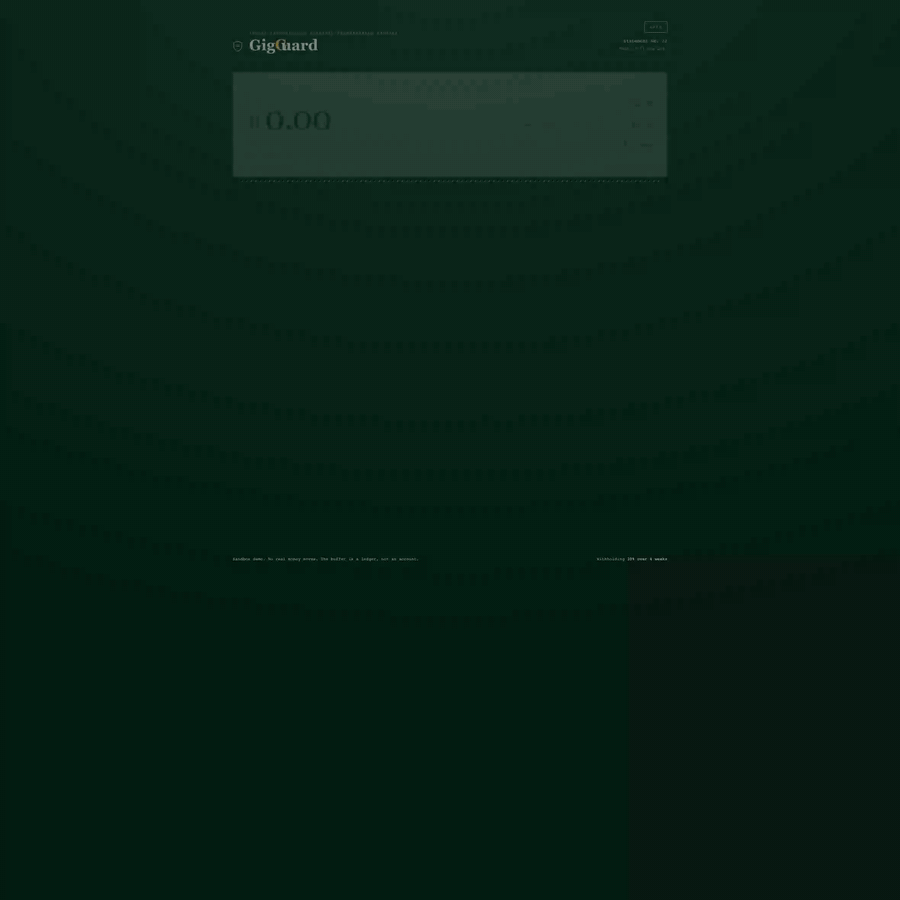
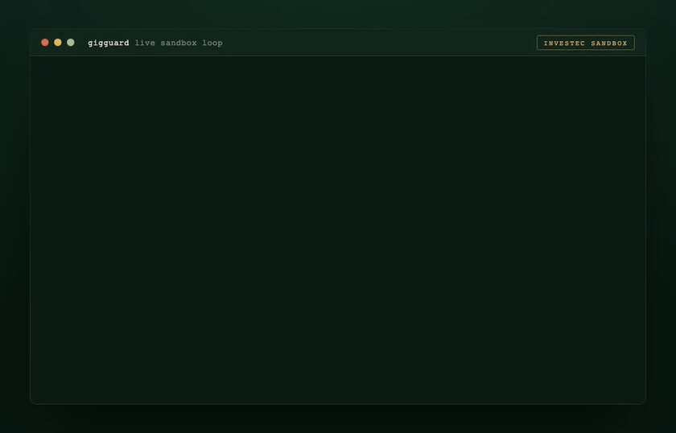
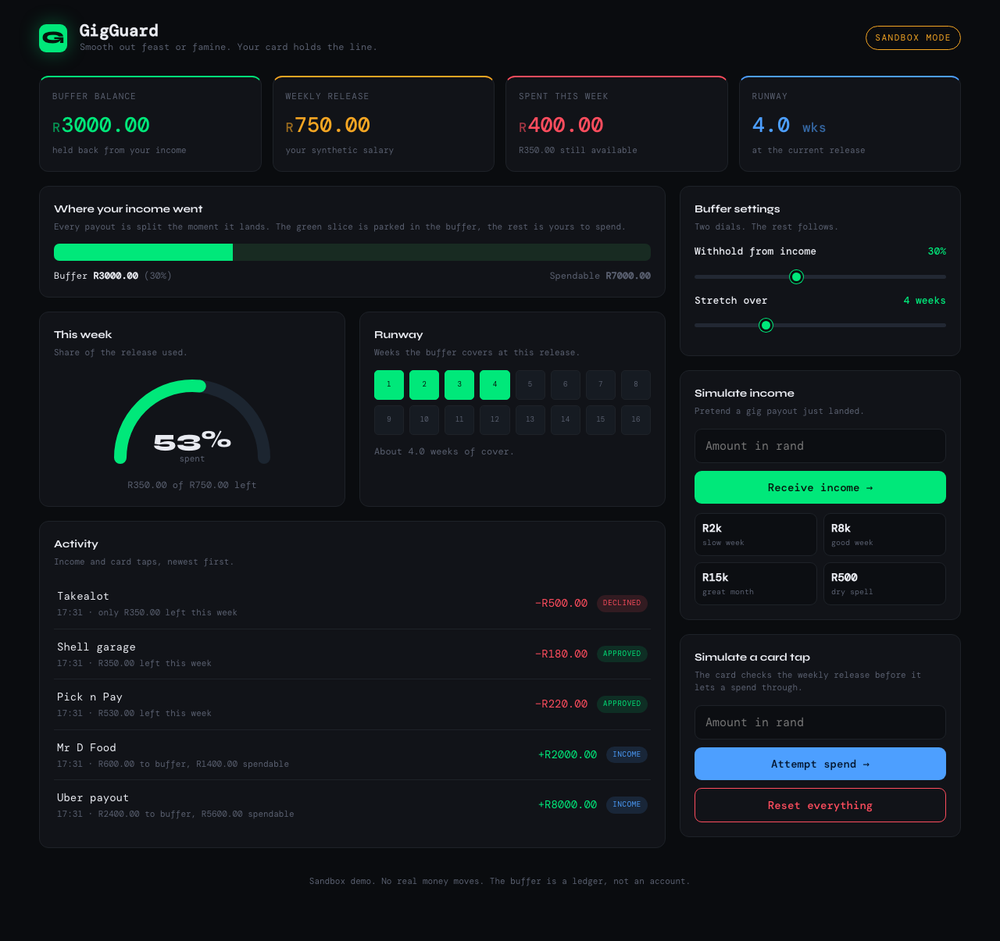
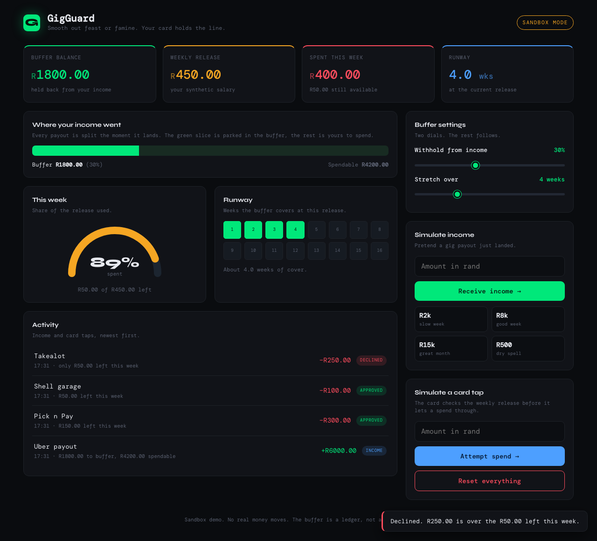

# GigGuard

**Programmable income smoothing for gig workers, built on Investec programmable banking.**

GigGuard turns the feast or famine of gig income into something that feels
like a steady weekly salary. When money lands, it quietly holds a slice back.
Each week it releases a fixed amount you are allowed to spend, and the
Investec programmable card enforces that limit at the bank itself. When the
backend answers within the card's roughly two second budget, going over the
weekly release is declined at the till, not just flagged afterwards. By
deliberate design it fails open: if the backend is unreachable the spend is
approved rather than stranding you at a till, so the cap is a strong self
imposed limit on this card, not an unbreakable lock. That honesty is the
point. Every rival in the field predicts or advises; GigGuard is the only one
that enforces.



*Income lands and a slice is withheld, a steady weekly amount is released, the meter fills as the week is spent, and a tap over the cap is declined. Sandbox only, no real money moves.*

> Sandbox project. No real money moves. The buffer is a ledger, not an
> account. Nothing here is financial advice.

---

## What it is

Three small pieces that work together:

1. A bit of **card code** that runs inside the Investec programmable card IDE.
   It intercepts every spend and asks the backend "is this allowed?".
2. A small **Express backend** that keeps a buffer ledger, watches the account
   for incoming gig payouts, and answers the card in well under a second.
3. A self contained **dashboard** you can open in any browser to see the whole
   thing move, with sliders and buttons to play out income and spending in the
   sandbox.

You can open `frontend/dashboard.html` right now, with no server and no setup,
and the full engine runs in the page. The only thing it fetches is two web
fonts from Google Fonts. Everything else is inline.

## The problem it solves

Gig workers do not get paid on a calendar. A good week pulls in R8,000, the
next week pulls in R600. The money that arrives in a burst tends to leave in a
burst, and then the quiet week hurts. Traditional budgeting apps warn you
after the fact. A warning is easy to swipe away at the till.

GigGuard moves the limit down to the card. The cap is not a reminder you can
swipe away, it is a decline at the till whenever the backend is reachable.
Instead of R8,000 that is gone by Wednesday and a R600 week that hurts, you get
a steady weekly amount you can plan around. Because the money never leaves your
own account, it stays a firm nudge rather than a vault, which is the honest
edge of a self imposed limit.

## Who this is for

GigGuard is for South African gig and informal workers whose pay arrives in
lumps: ride hailing drivers (Uber, Bolt, inDrive), delivery riders, freelancers
paid per invoice, and casual or piece rate labour. They are paid by the trip,
the job, or the week, never on a steady monthly calendar, so a good week and a
lean week sit right next to each other.

Picture the user, an illustration rather than a real interviewee: a Bolt driver
in Johannesburg who clears about R7,000 in a strong week and about R1,500 in a
slow one. The money lands in a burst and tends to leave in a burst, and then
the quiet week is the one that hurts. Rent, airtime, fuel, and food still
arrive on a calendar even when the income does not.

This is a large group. Stats South Africa put informal economy employment at
roughly 5.7 million people in the [Q4 2025 Quarterly Labour Force Survey](https://www.statssa.gov.za/?cat=31),
with hundreds of thousands of active ride hailing and delivery drivers among
them. We did not run a formal user study for this sandbox build, so we are not
claiming survey data. The pain comes from the shape of the work itself: payouts
that are lumpy by design, plus the plain fact that a warning notification is
easy to swipe away at the till. GigGuard is for the person who already knows
they overspend a feast week and wants a limit they set once and then cannot
casually argue their way out of in the checkout queue.

## How the buffer engine works

Everything is integer cents internally. Rands only appear when a human needs
to read a number. The whole engine is five lines of arithmetic:

```
on each incoming credit:
    toBuffer       = floor(incomeCents * bufferPercent / 100)
    spendable      = incomeCents - toBuffer
    bufferBalance += toBuffer
    weeklyRelease  = floor(bufferBalance / minWeeks)

on each card spend:
    remaining      = weeklyRelease - spentThisWeek
    decline if      spendCents > remaining
```

A worked example, the default 30 percent over 4 weeks:

```
R8,000 lands  ->  R2,400 to buffer, R5,600 spendable
                  weeklyRelease = floor(2400 / 4) = R600 a week
                  runway        = 2400 / 600       = 4.0 weeks

spend R200    ->  approved, R400 left this week
spend R500    ->  declined, only R400 left
spend R400    ->  approved exactly to the line, R0 left
```

`bufferPercent` is clamped to between 10 and 60. `minWeeks` is clamped to
between 1 and 12. Flooring always rounds in the safe direction, leaving the
odd cent in the buffer rather than handing it out.

## Architecture

```
        Gig payout lands in the Investec account
                          |
                          v
   poll transactions  +------------------------------+
   ----------------->  |  GigGuard backend            |
   Investec Accounts   |  Express, in memory ledger   |
   API                 |                              |
                       |  withhold bufferPercent      |
                       |  weeklyRelease = buffer/weeks|
                       +------------------------------+
                         ^             |
              /check     |             |   /status
              /record    |             |   /simulate/income
                         |             v
        +----------------------+   +-----------------------+
        |  Investec card code  |   |  Dashboard (one HTML) |
        |  beforeTransaction   |   |  sandbox playground   |
        |  afterTransaction    |   +-----------------------+
        +----------------------+
                         |
                         v
            Card approves or declines at the till
```

## Investec API usage

| Investec surface | How GigGuard uses it |
| --- | --- |
| OAuth token endpoint (`openapisandbox.investec.com/identity/v2/oauth2/token`) | Client credentials grant with the `accounts` scope. Token is cached until just before it expires. The live host is `identity.secure.investec.com/connect/token`. |
| Accounts transactions API (`openapisandbox.investec.com`) | Polled on a schedule to spot incoming CREDITs, which is how income is detected. |
| Card `beforeTransaction` hook | Calls the backend `/check` and declines the spend when it would break the weekly release. |
| Card `afterTransaction` hook | Calls the backend `/record` so approved debits are added to this week's running total. |

## Live sandbox run

This is not a mock. GigGuard runs against the real Investec sandbox. The shared
public sandbox credentials ship in `.env.example`, so you can clone, start the
backend, and poll the sandbox "Mr Smith" account yourself. Every number below
came back from the live Investec API.



```
# 1. Poll the real account: OAuth, then the transactions API
$ curl -X POST localhost:3000/poll -H 'x-api-key: ...' \
       -d '{"fromDate":"2026-03-01","toDate":"2026-06-01"}'
{
  "creditsCounted": 13,
  "skimmedToBuffer": "27871.33",
  "bufferBalance":  "27871.33",
  "weeklyRelease":  "6967.83",
  "window": { "fromDate": "2026-03-01", "toDate": "2026-06-01" }
}

# 2. Thirteen lumpy real credits (STANSAL, STANCOM, refunds, interest)
#    are now one steady weekly release
$ curl localhost:3000/status/demo -H 'x-api-key: ...'
{
  "bufferBalance":     "27871.33",
  "weeklyRelease":     "6967.83",
  "remainingThisWeek": "6967.83",
  "runwayWeeks":       "4.0"
}

# 3. The card beforeTransaction hook checks that weekly release
$ /check  R7,467.83  ->  { "approved": false, "reason": "Over the weekly release. R6967.83 left, this spend is R7467.83." }
$ /check  R250.00    ->  { "approved": true,  "reason": "Within the weekly release. R6717.83 left after this." }
```

The poll window is explicit here because the sandbox demo data sits a few months
in the past. In production the poll runs on a schedule from wherever it last left
off, so you never pass dates by hand.

## Monetisation

All prices in South African rand. This is a sandbox build, so none of it is
wired to a payment processor. It is the intended shape of the business, not a
live billing system.

### Who pays and why

The direct payer is the gig worker who has been burned by a blown out feast
week. The weekly release is the product: a steady amount they can plan around
instead of a balance that is gone by Wednesday. At R39 a month, Standard costs
about one declined then regretted impulse buy, which is roughly the thing it
exists to prevent. Willingness to pay is not even through the month. It peaks
right after a feast week crash, the first time the buffer carries someone
through a dry week they would otherwise have struggled with. That is the
natural moment for an upgrade prompt, a planned go to market mechanic rather
than something already built.

### Tiers

| Tier | Price | Intended buyer | What you get |
| --- | --- | --- | --- |
| Free | R0 | Anyone trying it | One card, manual buffer percent, weekly release enforced, dashboard. |
| Pay as you go | R1.50 per payout smoothed | The on ramp for a driver who only pays in weeks money lands | No monthly fee. You pay only when income arrives and gets smoothed. |
| Standard | R39 per month | The single gig regular, predictable enough to commit to a monthly fee | Automatic income polling, custom buffer and runway, transaction history. |
| Pro | R99 per month | The multi stream freelancer juggling several income sources | Multiple income streams, runway forecasting, export, priority support. |

Pay as you go is the entry point for exactly the headline user. R1.50 against a
typical weekly payout is a rounding error, and a weekly paid driver pays only
about R6 a month: cheaper than Standard, and self selecting for low volume
users who cannot commit to a fixed monthly debit.

### Unit economics

Because GigGuard never moves money, a smoothed payout costs almost nothing to
serve. It is one ledger write plus one polled API read, with no payment rail
fee on the smoothing itself. So the R1.50 per payout price is effectively all
margin, and the marginal cost of an extra user is dominated by the Investec API
call, not by money movement.

### Who actually pays at scale

Gig workers are, by definition, the segment least able to sustain a fixed
monthly consumer subscription, so a pure direct to driver model is the least
believable way to collect money at volume. The stronger channel is a partner
who already touches these workers and can pay per active seat. Fleet operators,
ride hailing aggregators, gig marketplaces, and earned wage or payroll
providers can offer GigGuard as a white labelled retention perk at roughly R25
per active driver per month (an illustrative intended rate, not a contract). A
driver whose rent survives a lean week keeps driving, so smoothing is a
retention tool for the platform, not just a favour to the worker. The
distribution win is that GigGuard reaches drivers through the platforms that
already pay them, rather than buying expensive consumer install ads, which
keeps acquisition cheap enough for a sub R40 direct price to make sense.

## Project structure

```
GigGuard/
  card-code/
    main.js          Deployed into the Investec card IDE (before/after transaction)
  backend/
    server.js        Express API: /check /record /poll /setup /status /simulate/income
    package.json
    test.js          Pure logic test suite, no server needed
  frontend/
    dashboard.html   Self contained interactive dashboard, one file
  docs/              Screenshots
  .env.example
  knowledge          Gotchas and learnings from building this
  README.md
  LICENSE
```

## Setup

### 1. Backend

```
cd backend
cp ../.env.example .env      # then open .env and fill in your values
npm install
npm start
```

The server boots with a ready made `demo` user. The data routes need the shared
key: the same value you set as `GIGGUARD_API_KEY` in `.env`, passed as an
`x-api-key` header. So you can poke it straight away:

```
curl localhost:3000/status/demo -H 'x-api-key: your-gigguard-api-key'
```

### 2. Onboard with curl

Configure the demo user (or any user id) with your Investec sandbox details
and your two dials:

```
curl -X POST localhost:3000/setup \
  -H 'content-type: application/json' \
  -H 'x-api-key: your-gigguard-api-key' \
  -d '{
    "userId": "demo",
    "investecClientId": "your-client-id",
    "investecSecret": "your-secret",
    "investecApiKey": "your-api-key",
    "accountId": "your-account-id",
    "bufferPercent": 30,
    "minWeeks": 4
  }'
```

Pretend a payout landed, then watch the buffer fill:

```
curl -X POST localhost:3000/simulate/income \
  -H 'content-type: application/json' \
  -H 'x-api-key: your-gigguard-api-key' \
  -d '{"amountRands": 8000}'

curl localhost:3000/status/demo -H 'x-api-key: your-gigguard-api-key'
```

Pull real sandbox transactions instead of simulating:

```
curl -X POST localhost:3000/poll \
  -H 'content-type: application/json' \
  -H 'x-api-key: your-gigguard-api-key' \
  -d '{"userId":"demo","fromDate":"2026-03-01","toDate":"2026-06-01"}'
```

Try a card check the way the `beforeTransaction` hook would. The hook sends
`amount` in cents, but you can pass `amountRands` by hand. A spend over the
weekly release comes back declined:

```
curl -X POST localhost:3000/check \
  -H 'content-type: application/json' \
  -H 'x-api-key: your-gigguard-api-key' \
  -d '{"amountRands": 7467.83, "merchant": "Game"}'
```

### 3. Card IDE

In the Investec programmable banking card IDE:

1. Paste the contents of `card-code/main.js` into the editor.
2. Add two environment variables in the IDE settings:
   * `GIGGUARD_WEBHOOK_URL` set to your backend's public base URL, for example
     a tunnel like `https://your-tunnel.ngrok.app`.
   * `GIGGUARD_API_KEY` set to the same value you put in the backend `.env`.
3. Save and deploy. Now every tap of the card checks the weekly release first.

### 4. Dashboard

Open `frontend/dashboard.html` in a browser. It needs no server and makes no
backend calls, and its only external request is two web fonts from Google
Fonts. The dashboard is laid out like a weekly statement: one big
"available to spend this week" figure on a paper card, with the buffer, the
weekly release meter, and the runway responding live as you simulate income
and card taps with the sliders and buttons.

A healthy week:



When a spend goes over the weekly release, the card declines it and a red
notice appears:



## Tests

The logic suite is pure arithmetic with no server and no network:

```
cd backend
node test.js
```

It prints a tick or a cross for each of the eleven checks and exits non zero if
any fail, so it drops straight into CI. The checks cover zero state, the
withholding split, status readout, approvals, the decline at the boundary, a
one cent overspend, stacked income, a zero credit, a different buffer and
runway setting, and a double tap that cannot both clear the weekly release.

## What it does and does not do

GigGuard is a budgeting and self control tool. Being precise about its edges is
part of the trust it asks for.

What it does:

* Skims a buffer percent off every detected income credit and releases a fixed
  weekly amount you set, so lumpy gig pay feels closer to a steady salary.
* Enforces that weekly limit at the Investec programmable card. When the backend
  answers within the card's roughly two second budget, a spend over the weekly
  release is declined at the till, not just flagged afterwards.
* Detects income by polling the Investec transactions API, runs the buffer math
  in integer cents, and keeps the weekly ledger in sync by recording only
  approved debits.

What it does not do:

* **No money moves.** It never moves, sweeps, transfers, holds, or escrows any
  money. The buffer is a ledger, a number that says how much of your own income
  you have chosen not to spend yet. Your cash stays in your own Investec account
  the whole time. GigGuard is not a deposit taking, custody, or payment business.
* **Not a vault.** Because the funds never leave your own account, it is a self
  imposed limit on this one card, a strong nudge rather than a lock. Someone
  determined to spend the withheld money another way still can.
* **No guarantee under failure.** By deliberate design it fails open: if the
  backend is slow, unreachable, or the key is wrong, the spend is approved rather
  than stranding you at a till. Wrongly declining your only card is the worse
  harm, so the cap is a strong best effort limit, not an unbreakable one. A short
  hold on each approved spend closes the common double tap case, two taps in the
  same instant, and there is a test for it. A spend that is approved but whose
  afterTransaction never arrives can still let the weekly total drift.
* **No advice.** It does not tell anyone what to do with their money. It enforces
  a limit you set for yourself.
* **No AI.** Every decision is deterministic integer arithmetic you can read in
  `backend/server.js` and reproduce with `backend/test.js`. There is no model, no
  inference, and nothing learned from your data.

Other guardrails:

* **Integer money.** All arithmetic is in cents. No floats touch a balance.
* **Clamped settings.** Buffer percent stays within 10 to 60, runway within 1 to
  12, no matter what a client sends.
* **Sandbox only.** This repo targets the Investec sandbox. Do not point it at a
  live account.

Privacy and data:

* Per user, GigGuard stores the Investec client id, secret, api key, and account
  id you provide, plus the buffer ledger and week state. In this demo all of that
  lives in memory only and is wiped on every server restart. Nothing is persisted
  to disk or shared with third parties beyond the Investec API calls the product
  is built on.
* The data routes (`/setup`, `/status`, `/poll`, `/simulate/income`) require the
  shared `GIGGUARD_API_KEY`. The card hooks (`/check`, `/record`) use the same key
  but fail open, so a bad key can never brick the card. Before any non local use,
  swap the single shared key for real per user authentication, and do not expose
  this backend to the public internet as is.

## Knowledge file

`knowledge` holds the ten things that actually cost time while building this,
including the two second card hook budget, the rands versus cents trap between
the API and the card, reading environment variables as `env.NAME` inside the
card IDE, why the after hook only records approved debits, why income is polled
rather than pushed, and why the buffer being a ledger and not an account keeps
this a budgeting tool rather than a regulated deposit business. Read it before
changing the card code.

## License

MIT. See [LICENSE](LICENSE).
