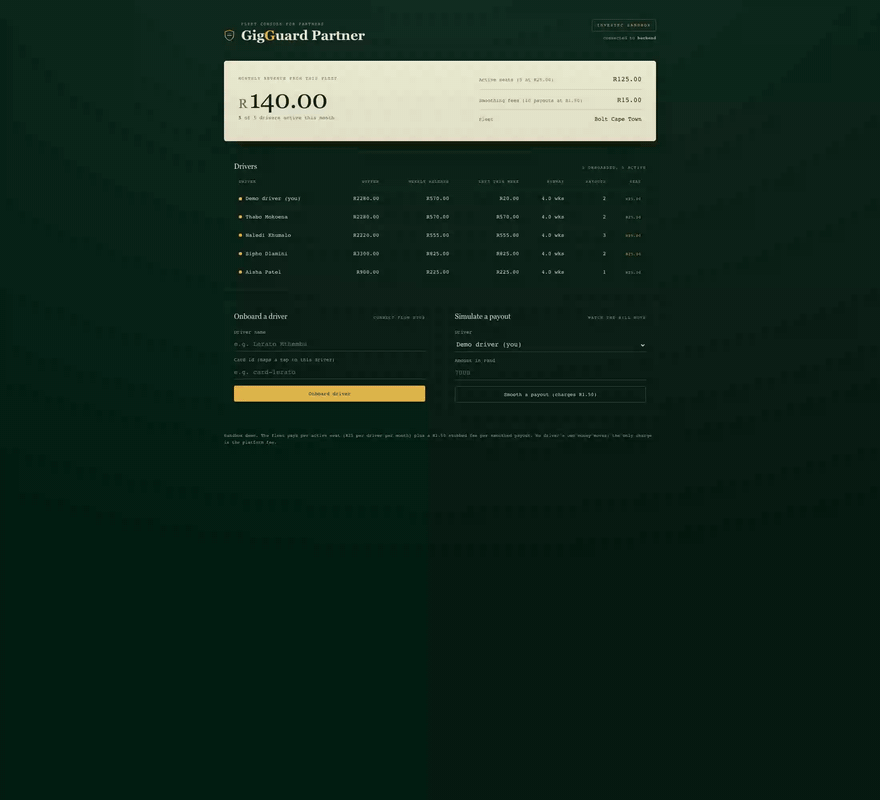
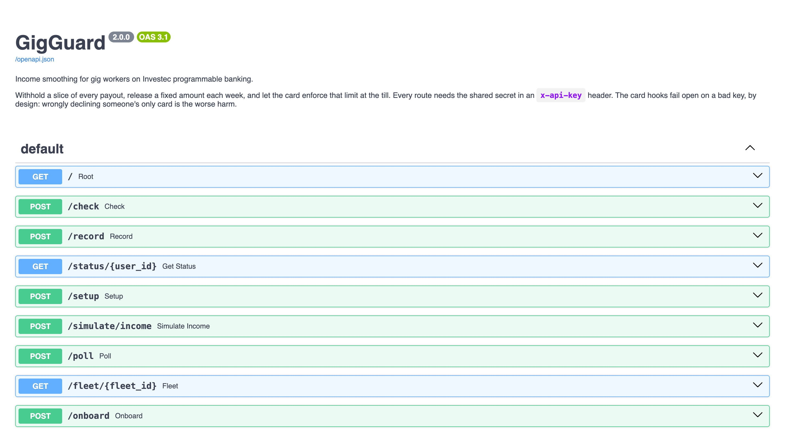
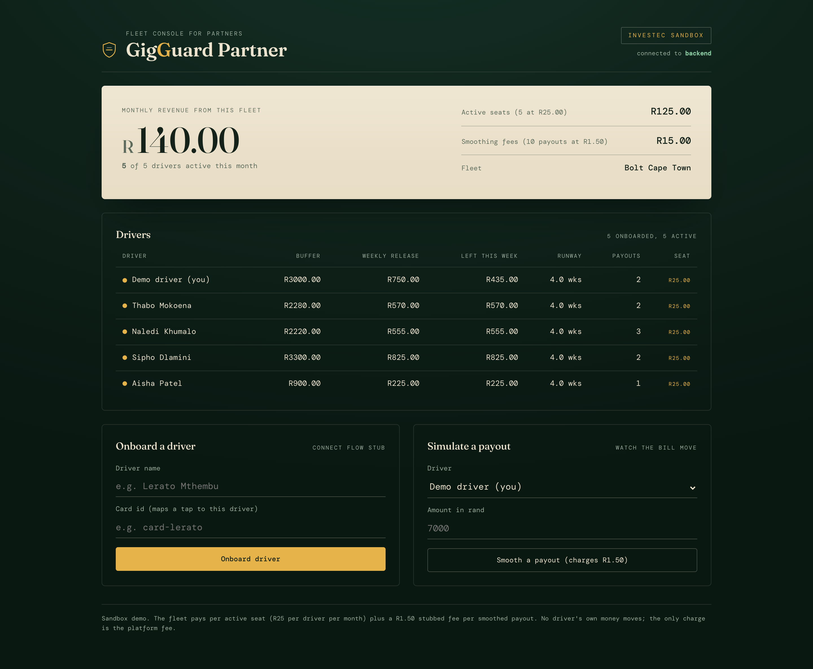

# GigGuard

**Income smoothing for gig workers, sold through the fleets and platforms they already drive for, on Investec programmable banking.**

GigGuard turns the feast or famine of gig income into something that feels like
a steady weekly salary. When a payout lands it quietly holds a slice back, and
each week it releases a fixed amount you may spend. The Investec programmable
card enforces that limit at the bank: go over the weekly release and the card
declines at the till. When the backend answers inside the card's roughly two
second budget it is a hard decline; by deliberate design it fails open if the
backend is unreachable, so the cap is a strong self imposed limit, not an
unbreakable lock. Every rival in the field predicts or advises. GigGuard is the
only one that enforces.

The business is B2B2C. A fleet operator or gig platform offers GigGuard to its
drivers as a retention perk and pays per active seat, and a stubbed per payout
fee covers the rest (see [Monetisation](#monetisation)). There are two surfaces,
both running live against the same multi tenant **FastAPI** backend.

**The driver's dashboard**, lumpy gig income smoothed into a steady weekly
release, then a spend over the cap declined:


**The partner's fleet console**, every driver's buffer plus the bill the fleet
pays (per active seat, plus the per payout smoothing fee):



> Sandbox project. No driver money moves; the buffer is a ledger, not an
> account. The only money that changes hands is our own fee, and even that is a
> stub. Nothing here is financial advice.

---

## What it is

Four pieces that work together:

1. **Card code** for the Investec programmable card IDE. On every tap it asks
   the backend "is this allowed?", passes the card id so one backend can serve a
   whole fleet, and reports approved debits back.
2. A multi tenant **FastAPI backend** that keeps a buffer ledger per driver,
   watches each account for incoming payouts, answers the card in well under a
   second, bills the fleet per active seat, takes a stubbed fee per smoothed
   payout, and persists everything to a JSON file so a restart does not wipe a
   ledger.
3. A **driver dashboard** (`frontend/dashboard.html`). Open it on its own and a
   built in engine runs the whole thing offline; point it at a running backend
   and it flips to a live mode that drives the real API.
4. A **partner console** (`frontend/partner.html`) for the fleet operator: every
   driver's buffer, the per seat bill, the smoothing revenue, and a one click
   onboard, all read live from the backend.

The driver dashboard opens standalone with no server (its only external request
is two web fonts from Google Fonts). The partner console needs the backend.

## The problem it solves

Gig workers do not get paid on a calendar. A good week pulls in R8,000, the
next week pulls in R600. The money that arrives in a burst tends to leave in a
burst, and then the quiet week hurts. Traditional budgeting apps warn you
after the fact. A warning is easy to swipe away at the till.

GigGuard moves the limit down to the card. The cap is not a reminder you can
swipe away, it is a decline at the till whenever the backend is reachable.
Instead of R8,000 that is gone by Wednesday and a R600 week that hurts, you get
a steady weekly amount you can plan around. Because the money never leaves your
own account, it stays a firm nudge rather than a vault, which is the honest
edge of a self imposed limit.

## Who this is for

GigGuard is for South African gig and informal workers whose pay arrives in
lumps: ride hailing drivers (Uber, Bolt, inDrive), delivery riders, freelancers
paid per invoice, and casual or piece rate labour. They are paid by the trip,
the job, or the week, never on a steady monthly calendar, so a good week and a
lean week sit right next to each other.

Picture the user, an illustration rather than a real interviewee: a Bolt driver
in Johannesburg who clears about R7,000 in a strong week and about R1,500 in a
slow one. The money lands in a burst and tends to leave in a burst, and then
the quiet week is the one that hurts. Rent, airtime, fuel, and food still
arrive on a calendar even when the income does not.

This is a large group. Stats South Africa put informal economy employment at
roughly 5.7 million people in the [Q4 2025 Quarterly Labour Force Survey](https://www.statssa.gov.za/?cat=31),
with hundreds of thousands of active ride hailing and delivery drivers among
them. We did not run a formal user study for this sandbox build, so we are not
claiming survey data. The pain comes from the shape of the work itself: payouts
that are lumpy by design, plus the plain fact that a warning notification is
easy to swipe away at the till. GigGuard is for the person who already knows
they overspend a feast week and wants a limit they set once and then cannot
casually argue their way out of in the checkout queue.

## How the buffer engine works

Everything is integer cents internally. Rands only appear when a human needs
to read a number. The whole engine is five lines of arithmetic, and it lives in
one file you can read in a sitting, [`backend/app/engine.py`](backend/app/engine.py):

```
on each incoming credit:
    to_buffer       = floor(income_cents * buffer_percent / 100)
    spendable       = income_cents - to_buffer
    buffer_balance += to_buffer
    weekly_release  = floor(buffer_balance / min_weeks)

on each card spend:
    remaining       = weekly_release - spent_this_week - held
    decline if       spend_cents > remaining
```

A worked example, the default 30 percent over 4 weeks:

```
R8,000 lands  ->  R2,400 to buffer, R5,600 spendable
                  weekly_release = floor(2400 / 4) = R600 a week
                  runway         = 2400 / 600      = 4.0 weeks

spend R200    ->  approved, R400 left this week
spend R500    ->  declined, only R400 left
spend R400    ->  approved exactly to the line, R0 left
```

`buffer_percent` is clamped to between 10 and 60. `min_weeks` is clamped to
between 1 and 12. A client that sends nonsense gets the safest setting rather
than an error, because the clamp is a guardrail on someone's money. Flooring
always rounds in the safe direction, leaving the odd cent in the buffer rather
than handing it out.

`held` is the piece that closes the gap between the two card hooks. An approved
`/check` reserves its amount until the matching `/record` settles it, so two
taps in the same blink cannot both read the same remaining balance. Reservations
expire on their own after about five seconds, because an approval whose record
never arrives must not wedge the cap shut.

## Architecture

```
        Gig payout lands in each driver's Investec account
                          |
                          v
   poll transactions  +-------------------------------+   /fleet  +-------------------+
   ----------------->  |  GigGuard backend             | <------- |  Partner console  |
   Investec Accounts   |  FastAPI, per driver ledger   | -------> |  drivers + billing|
   API                 |  persisted to a JSON file     |  /onboard +-------------------+
                       |                               |
                       |  withhold buffer_percent      |   /status      +------------------+
                       |  weekly_release = buffer/wks  | <------------- |  Driver dashboard|
                       |  bill per seat + per payout   | -------------> |  offline or live |
                       +-------------------------------+  /simulate     +------------------+
                         ^             |
              /check     |             |  cardId maps each tap to a driver
              /record    |             v
        +----------------------+
        |  Investec card code  |
        |  beforeTransaction   |
        |  afterTransaction    |
        +----------------------+
                         |
                         v
            Card approves or declines at the till
```

The backend is split so that the money is readable on its own:

| Module | What lives there |
| --- | --- |
| `app/engine.py` | Every rule GigGuard enforces. No framework, no network, no clock it does not accept as an argument. |
| `app/driver.py` | One driver's ledger, which doubles as the persistence format. |
| `app/store.py` | The drivers, the JSON file behind them, and a lock per driver. |
| `app/investec.py` | Tokens and transactions, plus the rands to cents boundary. |
| `app/models.py` | Request and response shapes, snake_case in Python and camelCase on the wire. |
| `app/security.py` | The shared key, in both a fail closed and a fail open flavour. |
| `app/main.py` | The routes, grouped by who calls them. |

## The FastAPI rebuild

The first build was Express. The port to FastAPI was not a rewrite for its own
sake; three things about the old build were worth fixing:

* **The tests did not test the server.** `test.js` kept its own hand copied
  version of the buffer arithmetic, so the suite could pass while `server.js`
  was wrong. The pytest suite imports the real `engine` functions the card hook
  calls, so a changed rule shows up whether the author remembered the tests or
  not.
* **The double tap guard was narrow, not safe.** Reservations alone made the
  race unlikely. Now the reserve and the settle both happen under a per driver
  lock, so within one process the decision really is atomic.
* **The request shapes were assumed, not declared.** Validation was a hand
  rolled `clamp` and a lot of `!== undefined`. Pydantic models now declare every
  field once, which also means the API documents itself.

What came for free with the move: an OpenAPI schema and a live docs page at
`/docs`, typed responses, constant time key comparison, an atomic store write,
and `httpx` for the Investec calls so a slow bank cannot pin a worker.



Two deliberate differences from the Express build. The port stayed at 3000, so
the dashboards, the card IDE webhook URL and every curl below carry over
untouched. Error bodies are now FastAPI's `{"detail": "..."}` rather than
`{"error": "..."}`, which is consistent across 400, 401, 404 and 422; the card
code only ever checked the status, so nothing downstream cares.

## Investec API usage

| Investec surface | How GigGuard uses it |
| --- | --- |
| OAuth token endpoint (`openapisandbox.investec.com/identity/v2/oauth2/token`) | Client credentials grant with the `accounts` scope. Token is cached until just before it expires. The live host is `identity.secure.investec.com/connect/token`. |
| Accounts transactions API (`openapisandbox.investec.com`) | Polled on a schedule to spot incoming CREDITs, which is how income is detected. |
| Card `beforeTransaction` hook | Calls the backend `/check` and declines the spend when it would break the weekly release. |
| Card `afterTransaction` hook | Calls the backend `/record` so approved debits are added to this week's running total. |

## Live sandbox run

This is not a mock. GigGuard runs against the real Investec sandbox. The shared
public sandbox credentials ship in `.env.example`, so you can clone, start the
backend, and poll the sandbox "Mr Smith" account yourself. Every number below
came back from the live Investec API.

```
# 1. Poll the real account: OAuth, then the transactions API
$ curl -X POST localhost:3000/poll -H 'x-api-key: ...' \
       -d '{"userId":"demo","fromDate":"2026-03-01","toDate":"2026-06-01"}'
{
  "creditsCounted":   6,
  "skimmedToBuffer":  "18304.82",
  "bufferBalance":    "18304.82",
  "weeklyRelease":    "4576.20",
  "feesCharged":      "9.00",
  "window": { "fromDate": "2026-03-01", "toDate": "2026-06-01" }
}

# 2. Six lumpy real credits are now one steady weekly release
$ curl localhost:3000/status/demo -H 'x-api-key: ...'
{
  "bufferBalance":     "18304.82",
  "weeklyRelease":     "4576.20",
  "remainingThisWeek": "4576.20",
  "runwayWeeks":       "4.0"
}

# 3. The card beforeTransaction hook checks that weekly release
$ /check  R5,000.00  ->  { "approved": false, "reason": "Over the weekly release. R4576.20 left, this spend is R5000.00." }
$ /check  R250.00    ->  { "approved": true,  "reason": "Within the weekly release. R4326.20 left after this." }
```

The poll window is explicit here because the sandbox demo data sits a few months
in the past. In production the poll runs on a schedule from wherever it last left
off, so you never pass dates by hand. The sandbox account is shared and its
transaction history rolls, so your own credit count will differ from the run
above; what stays the same is the shape, real OAuth then real transactions then a
real decline.

## Monetisation

All prices in South African rand, all illustrative. The charge is a stub, not a
live payment integration. But this is no longer just a slide: the partner
console shows the bill, and the backend takes the per payout fee on every
smoothed payout, so you can watch the revenue tick up as the demo runs.

### Fleets pay per seat, the main line

The believable payer is not the gig worker, who by definition has the least cash
to spare. It is the partner who already touches the worker and benefits when the
worker keeps working: a fleet operator, ride hailing aggregator, gig
marketplace, or earned wage provider. They offer GigGuard to their drivers as a
retention perk and pay per active seat, roughly **R25 per active driver per
month**. A driver whose rent survives a lean week keeps driving, so smoothing is
a retention tool for the platform, not a favour to the worker, and GigGuard
reaches drivers through the people who already pay them rather than through
expensive consumer ads. The partner console (`frontend/partner.html`) bills
exactly this, and `/fleet/{fleet_id}` returns the line items.

An onboarded driver only becomes a billable seat once they have actually banked
something, so a fleet is never charged for a name on a list.

### Plus a fee per smoothed payout

On top of the seat, GigGuard takes a small fee for each payout it smooths,
**R1.50**, stubbed in `charge_for_payout` where a real build would call Paystack.
Because no driver money moves, a smoothed payout costs almost nothing to serve
(one ledger write plus one polled API read), so the fee is effectively all
margin. Every `/poll` and `/simulate/income` charges it.

### A direct consumer on ramp, the secondary line

A driver can also pay directly, which is the channel before a fleet deal exists.
This is the weaker line on purpose (the headline user is cash strapped exactly
when they need it), so it is priced to self select:

| Tier | Price | Intended buyer |
| --- | --- | --- |
| Free | R0 | Anyone trying it, one card, the cap enforced |
| Pay as you go | R1.50 per payout | A driver who only pays in weeks money actually lands, about R6 a month |
| Standard | R39 per month | A single gig regular, predictable enough to commit |
| Pro | R99 per month | A multi stream freelancer with several income sources |

## Project structure

```
GigGuard/
  card-code/
    main.js            Deployed into the Investec card IDE (before/after transaction)
  backend/
    app/
      main.py          The routes: card hooks, poll, status, fleet, onboard
      engine.py        The buffer engine. Every rule, no framework
      driver.py        One driver's ledger, and the persistence format
      store.py         The drivers, the JSON file, a lock per driver
      investec.py      OAuth, transactions, the rands to cents boundary
      models.py        Request and response shapes
      security.py      The shared key, fail closed and fail open
      config.py        Settings read from .env
      __main__.py      python -m app
    tests/
      test_engine.py   The money math, against the real engine
      test_api.py      The HTTP surface, auth, card hooks, billing
      test_poll.py     Polling, with the bank stubbed
    pyproject.toml
    requirements.txt
    data/              Persisted store (gitignored, created on first run)
  frontend/
    dashboard.html     Driver dashboard, standalone offline or live against the backend
    partner.html       Partner / fleet console, reads live from the backend
  docs/                Screenshots and demo GIFs
  .env.example
  knowledge            Gotchas and learnings from building this
  README.md
  LICENSE
```

## Setup

### 1. Backend

Python 3.11 or newer.

```
cd backend
cp ../.env.example .env      # then open .env and fill in your values
python3 -m venv .venv
source .venv/bin/activate
pip install -r requirements.txt
python -m app
```

`python -m app` reads the host and port out of `.env`, so `PORT` stays one
setting that the dashboards, the card IDE and the curls below all agree on. If
you would rather drive uvicorn yourself:

```
uvicorn app.main:app --port 3000
```

The server boots with a ready made demo fleet: a `demo` driver carrying the
sandbox credentials from `.env`, plus four simulated drivers so both dashboards
have something to show. The routes need the shared key, the same value you set
as `GIGGUARD_API_KEY` in `.env`, passed as an `x-api-key` header. So you can
poke it straight away:

```
curl localhost:3000/status/demo -H 'x-api-key: your-gigguard-api-key'
```

Every route, request shape and response shape is browsable at
[localhost:3000/docs](http://localhost:3000/docs), generated from the code.

### 2. Onboard with curl

Configure the demo driver (or any user id) with your Investec sandbox details
and your two dials:

```
curl -X POST localhost:3000/setup \
  -H 'content-type: application/json' \
  -H 'x-api-key: your-gigguard-api-key' \
  -d '{
    "userId": "demo",
    "investecClientId": "your-client-id",
    "investecSecret": "your-secret",
    "investecApiKey": "your-api-key",
    "accountId": "your-account-id",
    "bufferPercent": 30,
    "minWeeks": 4
  }'
```

Anything you leave out of `/setup` keeps its current value, so the dashboard can
nudge one slider without wiping the rest.

Pretend a payout landed, then watch the buffer fill:

```
curl -X POST localhost:3000/simulate/income \
  -H 'content-type: application/json' \
  -H 'x-api-key: your-gigguard-api-key' \
  -d '{"userId": "demo", "amountRands": 8000}'

curl localhost:3000/status/demo -H 'x-api-key: your-gigguard-api-key'
```

Pull real sandbox transactions instead of simulating:

```
curl -X POST localhost:3000/poll \
  -H 'content-type: application/json' \
  -H 'x-api-key: your-gigguard-api-key' \
  -d '{"userId":"demo","fromDate":"2026-03-01","toDate":"2026-06-01"}'
```

Try a card check the way the `beforeTransaction` hook would. The hook sends
`amount` in cents, but you can pass `amountRands` by hand and mean the same
money. A spend over the weekly release comes back declined:

```
curl -X POST localhost:3000/check \
  -H 'content-type: application/json' \
  -H 'x-api-key: your-gigguard-api-key' \
  -d '{"amountRands": 5000, "merchant": "Game", "cardId": "card-demo"}'
```

Onboard a driver into a fleet, then read the fleet's bill (every driver plus the
per seat and per payout revenue):

```
curl -X POST localhost:3000/onboard \
  -H 'content-type: application/json' \
  -H 'x-api-key: your-gigguard-api-key' \
  -d '{"driverName": "Lerato Mthembu", "cardId": "card-lerato", "fleetId": "bolt-cpt"}'

curl localhost:3000/fleet/bolt-cpt -H 'x-api-key: your-gigguard-api-key'
```

State persists to `backend/data/store.json` (gitignored), so a restart keeps the
fleet and its ledgers. Delete that file to reseed the demo fleet from scratch.

### 3. Card IDE

In the Investec programmable banking card IDE:

1. Paste the contents of `card-code/main.js` into the editor.
2. Add two environment variables in the IDE settings:
   * `GIGGUARD_WEBHOOK_URL` set to your backend's public base URL, for example
     a tunnel like `https://your-tunnel.ngrok.app`.
   * `GIGGUARD_API_KEY` set to the same value you put in the backend `.env`.
3. Save and deploy. Now every tap of the card checks the weekly release first.

The backend binds to loopback by default. Put a tunnel in front of it rather
than binding it to the world; it holds Investec credentials and has one shared
key on the door.

### 4. Driver dashboard

Open `frontend/dashboard.html` in a browser. With no backend it runs a built in
engine offline and the badge reads Sandbox; with the backend running it auto
detects it, flips the badge to Live, and drives the real API for income, card
checks, and settings. It is laid out like a weekly statement: one big "available
to spend this week" figure on a paper card, with the buffer, the weekly release
meter, and the runway responding as you simulate income and card taps.

A healthy week, live against the FastAPI backend:


When a spend goes over the weekly release, the card declines it and a red
notice appears. Note that the decline moves nothing: the R435.00 still available
is the same figure as before the attempt.


### 5. Partner console

Open `frontend/partner.html` with the backend running. This is the fleet
operator's view: every driver's buffer and weekly release, and the monthly bill
broken into per active seat and per payout smoothing fees. Onboard a driver or
simulate a payout from the page and watch the bill move. It points at
`http://localhost:3000` by default; override with `?api=` and `?key=` in the URL.



## Tests

```
cd backend
pytest
```

Sixty seven checks across three files, all offline, no Investec call anywhere in
the suite:

| File | Checks | What it covers |
| --- | --- | --- |
| `tests/test_engine.py` | 31 | The money. Withholding, the decline at the boundary, a one cent overspend, flooring in the safe direction, the double tap, holds expiring, the lazy week reset, the fee, the fleet bill, the clamps. |
| `tests/test_api.py` | 21 | The HTTP surface. Fail closed on the data routes and fail open on the card hooks, a full payout to till journey, an unknown card, the after hook ignoring anything that is not an approved debit, cents versus rands, persistence across a restart. |
| `tests/test_poll.py` | 15 | Polling with the bank stubbed. Which rows count as income, re-polling not double counting, two identical same day payouts not collapsing, the window handling, a bank outage reading as a 502. |

These import the real functions the card hook calls. The Express build's suite
kept its own copy of the arithmetic, which meant it could pass while the server
was wrong; that is the single biggest reason the backend was rebuilt.

## What it does and does not do

GigGuard is a budgeting and self control tool. Being precise about its edges is
part of the trust it asks for.

What it does:

* Skims a buffer percent off every detected income credit and releases a fixed
  weekly amount you set, so lumpy gig pay feels closer to a steady salary.
* Enforces that weekly limit at the Investec programmable card. When the backend
  answers within the card's roughly two second budget, a spend over the weekly
  release is declined at the till, not just flagged afterwards.
* Detects income by polling the Investec transactions API, runs the buffer math
  in integer cents, and keeps the weekly ledger in sync by recording only
  approved debits.

What it does not do:

* **No driver money moves.** It never moves, sweeps, transfers, holds, or
  escrows a driver's money. The buffer is a ledger, a number that says how much
  of their own income they have chosen not to spend yet; their cash stays in
  their own Investec account the whole time. The only money that changes hands is
  our own fee, per seat and per payout, and in this build even that is a stub,
  not a live charge. GigGuard is not a deposit taking, custody, or payment
  business.
* **Not a vault.** Because the funds never leave your own account, it is a self
  imposed limit on this one card, a strong nudge rather than a lock. Someone
  determined to spend the withheld money another way still can.
* **No guarantee under failure.** By deliberate design it fails open: if the
  backend is slow, unreachable, or the key is wrong, the spend is approved rather
  than stranding you at a till. Wrongly declining your only card is the worse
  harm, so the cap is a strong best effort limit, not an unbreakable one. The
  reservation plus the per driver lock make the double tap case safe within one
  process, and there is a test for it, but a spend that is approved and whose
  `afterTransaction` never arrives can still let the weekly total drift, and
  several backend instances would need a shared lock rather than a local one.
* **No advice.** It does not tell anyone what to do with their money. It enforces
  a limit you set for yourself.
* **No AI.** Every decision is deterministic integer arithmetic you can read in
  `backend/app/engine.py` and reproduce with `pytest`. There is no model, no
  inference, and nothing learned from your data.

Other guardrails:

* **Integer money.** All arithmetic is in cents. No floats touch a balance.
* **Clamped settings.** Buffer percent stays within 10 to 60, runway within 1 to
  12, no matter what a client sends.
* **Sandbox only.** This repo targets the Investec sandbox. Do not point it at a
  live account.

Privacy and data:

* Per driver, GigGuard stores the Investec client id, secret, api key, and
  account id provided, plus the buffer ledger and week state. It persists to a
  gitignored JSON file (`backend/data/store.json`), written to a temporary file
  and moved into place so a crash mid write cannot leave half a ledger behind. A
  real build would use a database with the secrets encrypted at rest. The cached
  OAuth token is deliberately never written to disk. Nothing is shared with third
  parties beyond the Investec API calls the product is built on.
* The data routes (`/setup`, `/status`, `/poll`, `/simulate/income`, `/onboard`,
  `/fleet`) require the shared `GIGGUARD_API_KEY` and refuse without it. The card
  hooks (`/check`, `/record`) take the same key but fail open, so a bad key can
  never brick the card. Keys are compared in constant time. Before any non local
  use, swap the single shared key for real per driver authentication, narrow
  `CORS_ORIGINS` from its wide open default, and do not expose this backend to the
  public internet as is.

## Knowledge file

`knowledge` holds the eleven things that actually cost time while building this,
including the two second card hook budget, the rands versus cents trap between
the API and the card, reading environment variables as `env.NAME` inside the
card IDE, why the after hook only records approved debits, why income is polled
rather than pushed, the gap between `/check` and `/record`, and why the buffer
being a ledger and not an account keeps this a budgeting tool rather than a
regulated deposit business. Read it before changing the card code.

## License

MIT. See [LICENSE](LICENSE).
